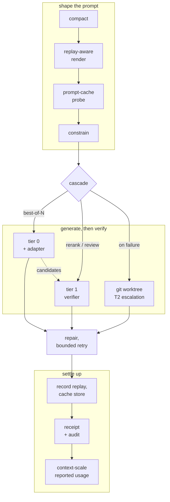

<h1 align="center">Orbit</h1>

<p align="center">
  <strong>A local coding-agent runtime that optimises for merge quality.</strong><br>
  One machine, two model tiers, and a receipt for every change.
</p>

<p align="center">
  <a href="https://github.com/nodenova/orbit/actions/workflows/ci.yml"></a>
  <a href="https://www.python.org/downloads/"></a>
  <a href="LICENSE"></a>
  
  
</p>

---

A fast resident model, adapted to *your* repository from its own git history, generates
candidate patches. A large model reads those candidates and picks or rejects them — a
**verifier, never a generator**. A hash-chained receipt proves which base and which adapter
produced each change.

Orbit speaks the Anthropic, OpenAI chat-completions and OpenAI responses APIs from one
process, so Claude Code, OpenCode, Crush and Codex all point at the same
`127.0.0.1:8080` and share one model, one prompt cache and one router.

```bash
pip install -e '.[dev,constrain]'
orbit serve --backend mock                        # gateway on 127.0.0.1:8080
ANTHROPIC_BASE_URL=http://127.0.0.1:8080 claude   # point a harness at it
```

Nothing under `src/orbit/` makes an outbound network call. That is not a promise, it is a
test — see [Offline by construction](#offline-by-construction).

## Contents

- [Why this shape](#why-this-shape) · [Status](#status) · [Requirements](#requirements) · [Install](#install)
- [Run](#run) · [Configure](#configure) · [Build an adapter](#build-an-adapter) · [Gates and evals](#gates-and-evals)
- [How it works](#how-it-works) · [Offline by construction](#offline-by-construction) · [Documentation](#documentation)
- [Testing and CI](#testing-and-ci) · [Contributing](#contributing) · [Licence](#licence)

## Why this shape

Three facts, one product.

**1. Streamed models are ~40× cheaper per input token than per output token.** Decode
streams top-k experts per token — **4.05 tok/s measured**, unusable. Prefill with a
batch-union sweep reads each expert once per chunk — **165 tok/s measured**. Every
published number in the field is single-request decode, so the field concluded streamed
models are too slow. That is correct *for generation* and wrong for any task where input
dominates output.

**2. The tasks where input dominates output are exactly the tasks that determine merge
quality.** Reranking N candidates emits an integer. Reviewing a diff emits a verdict. Both
read 5–30k tokens and write 10–300.

**3. Merge quality, not benchmark score, is the binding constraint.** METR's standing
finding: ~half of SWE-bench-passing PRs would not be merged by maintainers. A local 35B at
73.4% SWE-bench Verified is not short of capability — it is short of *this repository's*
conventions, which is what a repo-derived adapter encodes and a verifier pass enforces.

Both terms of fact 1 are measured on this project's reference machine, not borrowed:
[`docs/platform.md`](docs/platform.md) §4.

## Status

Honest summary: **the system runs, one tier is real, and the numbers are arriving one gate
at a time.**

| Layer | State |
|---|---|
| Gateway, router, tool-call reliability, adapters, eval, attestation | **built and tested** — 570 tests, runs on any Python 3.11+ box |
| Tier 0 (resident generator) | **run against real weights** — `Qwen3.6-35B-A3B-OptiQ-4bit`, 23.0 GiB, on an M4 Max |
| Tool-call gate (sec 10.2) | **passes** — 1.00 well-formed over 100 runs, 100/100 first-attempt calls |
| Gate B (streamed prefill, sec 11) | **passes at spec** — 258.0 tok/s on `Qwen3-Coder-Next-4bit` against a 200 floor, at 1.36 GB resident. The 122B reads 153.7, which clears this host's floor but not the spec's |
| Gate A (latency) | **run, partial.** Decode passes at 69.6 tok/s; TTFT fails at 30.5 s @32k, and the failure is arithmetic |
| Tier 1 (verifier) | **rung 1 serves.** Still *deployed* as rung 3 — tier 0 with its adapter stripped — which is ~3.5× faster and costs no memory |
| Determinism (sec 9.3) | **measured, and G1 is red.** CPU and Metal diverge 4.375 logits against a 1.625 greedy margin and flip the first token — MLX runs a different linear-attention algorithm on CPU, so byte-identity is not the platform's to give. The same configuration reproduces *bitwise* |
| Adapter isolation (sec 4.2) | **not run — needs a trained adapter.** No longer blocked by memory |

The distinction that matters: every gate's *plumbing* is proven; not every *number* is.
Everything above the backend interface runs against `MockBackend` — a deterministic,
adapter-sensitive, faultable stand-in, good enough that the whole system is testable
without a Mac and honest enough that the tests mean something.

> [!NOTE]
> **That honesty has been tested.** The first real-weights run found that
> `MLXTier0Backend` accepted a JSON schema and never applied it, so constrained decoding
> was computed, carried down the whole pipeline and dropped — while the mock honoured it.
> **The mock was stricter than the hardware**, which is why a fully green suite could not
> see it. Fixing it moved the tool-call gate from 0.81 and failing to 1.00 and passing.

[`docs/spec-map.md`](docs/spec-map.md) has the section-by-section map and the three
documented deviations.

## Requirements

**Running the gateway, the extractors, the evals and the whole test suite needs only
Python 3.11+.** That is the portable half of the system, and it is the half you can
develop against today on any OS.

**Serving a real model needs Apple Silicon.** The baseline platform is a **MacBook Pro
M4 Max, 36 GB unified memory, 1 TB SSD**, and every budget in the repository derives from
it — see [`docs/platform.md`](docs/platform.md). One consequence worth knowing up front:
Metal's real ceiling is `max_recommended_working_set_size` = **28.08 GiB**, not 36 GB, and
tier 0 alone is 23.0 GiB of it.

Python 3.14 is the current release and 3.11 the declared floor; CI runs both, so both are
guarded. 3.12 and 3.13 sit between two tested ends rather than being tested themselves.

## Install

```bash
pip install -e '.[dev]'                # core + tests, runs anywhere
pip install -e '.[dev,constrain]'      # + constrained decoding (what CI installs)
pip install -e '.[dev,mlx]'            # + Apple Silicon backends
```

`[dev]` and `[dev,constrain]` exercise genuinely different paths — repair versus prevention
(sec 8.5) — and both are expected to pass.

Dependency licence discipline is Apache-2.0 / MIT / BSD only. Every dependency is a
security surface, not a convenience; the LiteLLM 1.82.7/1.82.8 supply-chain compromise is
the standing precedent.

## Run

```bash
orbit doctor                           # runtime status + offline posture
orbit serve --backend mock             # gateway on 127.0.0.1:8080
```

Point a harness at it:

```bash
source <(orbit offline-env)            # the airgap environment (sec 8.6)
ANTHROPIC_BASE_URL=http://127.0.0.1:8080 claude
OPENAI_BASE_URL=http://127.0.0.1:8080/v1 opencode
```

Three wire protocols from one process, sharing one model, one prompt cache and one router —
because a product whose entire value depends on one closed client is one product decision
from zero:

| Endpoint | Serves |
|---|---|
| `POST /v1/messages` | Claude Code, OpenClaw |
| `POST /v1/chat/completions` | OpenCode, Crush, generic |
| `POST /v1/responses` | Codex |

Local introspection, no network: `/orbit/health`, `/orbit/stats`,
`/orbit/compaction/last` (the diff view), `/orbit/trace/last`, `/orbit/audit/verify`.

Streaming is incremental where it honestly can be: a `chat` turn carrying no tools emits
tokens as they are decoded. A `code_change` turn under best-of-N runs to completion first
and says so in `/orbit/trace/last` — there are no tokens to emit until the verifier has
chosen a candidate, and streaming candidate 0 then retracting it would be worse than a
pause.

> [!WARNING]
> On Apple Silicon, `orbit doctor`, `serve`, both gates, `bench`, `eval` and `train` each
> load 23.0 GiB eagerly, and only one process can hold the GPU.
> [`docs/operations.md`](docs/operations.md) is the pre-flight procedure — read it before
> starting a second serving process.

## Configure

Copy [`orbit.toml.example`](orbit.toml.example) to `orbit.toml`. Every knob is documented
in place, and **unknown keys are a hard error** rather than a silent no-op — a typo'd
`expert_cache_bytes` that appears to take effect and does not is how a wrong number ends up
in a published measurement.

**`tier1.rung`** picks which rung of the sec 5.5 fallback ladder serves the verifier. The
rung is *selected, never descended*: no error path silently picks a different one.

| Rung | `tier1.rung` | What it is |
|---|---|---|
| 1 | `streamed` | A large MoE with experts streamed from SSD. Serves, and `Qwen3-Coder-Next-4bit` passes Gate B at spec — but a 30k review is ~130 s against rung 3's ~33 s. |
| 2 | `resident_swap` | An 80B swapped into residency, evicting tier 0 — ~10 s each way, and tier 0 cannot serve while it is in. |
| 3 | `second_opinion` | Tier 0 with its adapter unmounted. Free, weak, needs no second model, and still catches adapter overfit. **What ships.** |
| 4 | `remote` | Somebody else's API. Breaks the offline claim, so it needs `tier1.remote_consent` written out in full. |

**`[eval]`** declares what the repository runs to check itself. Three of the merge eval's
five metrics and the whole of T2 failure escalation depend on it, and there is no way to
guess it:

```toml
[eval]
linters = [["ruff", "check"]]
test_command = ["pytest", "-q", "-x"]
```

Leave it out and those metrics report as *not measured*, which is the honest answer rather
than a passing one.

**`[gates]`** sets what *this host* is judged against. Code defaults are the specification's
figures, so an absent block judges the spec. Relaxing one hides nothing: every gate reports
`spec_budget` beside `budget`, `meets_spec` beside `pass`, and `relaxed_criteria` naming
each row that is green only because of the block. A pass against a relaxed floor means
"this host cleared its own floor", never "Gate A passed".

## Build an adapter

```bash
# A0 — harness adapter. Universal, cheapest, the sleeper win.
orbit extract a0 --n 4000 --out corpus/a0
orbit train sft --corpus corpus/a0/train.jsonl --out adapters/a0 \
    --name a0-harness --source-kind synthetic_harness

# A1 — repository adapter from your own git history.
orbit extract a1 --repo . --holdout 25 --out corpus/a1
orbit train sft --corpus corpus/a1/train.jsonl --out adapters/a1-myrepo \
    --name a1-myrepo --repo .

# A2 — reviewer adapter, DPO from review history. Starts from A1.
orbit extract a2 --repo . --out corpus/a2
orbit train dpo --corpus corpus/a2/train.jsonl --out adapters/a2-myrepo \
    --name a2-myrepo --repo . --mount-adapter adapters/a1-myrepo
```

`extract` exits **2** when the corpus is too thin (< 500 pairs for A1). That is not a
failure to work around — below that, A1 underfits, and the honest answer is to tell the
customer rather than ship a null adapter.

A2 is stronger with real review timestamps, which live in the forge rather than in git.
[`tools/export_reviews.py`](tools/export_reviews.py) fetches them; without it, extraction
falls back to the first branch commit and labels every pair with which signal produced it.

## Gates and evals

```bash
orbit gate toolcall --runs 100    # sec 10.2 — blocking, >=99% well-formed
orbit gate isolation              # sec 4.2  — blocking, adapter deltas must not leak
orbit eval merge --repo . --a1 a1-myrepo    # sec 10.1 — the four bars
orbit eval regression             # sec 10.3 — diff against a baseline, not a score
orbit bench latency               # sec 10.4 + M0 Gate A
orbit bench tier1                 # M0 Gate B — streamed prefill
orbit audit verify                # sec 9.2 — hash-chained log
```

`orbit eval merge` is the one that matters. **If the adapter doesn't beat the base model on
the customer's own repo, there is no product** — and it is designed to say so at M3,
week 8, before tier 1 is built.

Each generated patch is applied in a detached git worktree at the held-out change's own
parent commit, and the `[eval]` commands run there — never in your checkout, and never
against the files as they sit on disk, which would score the repository rather than the
patch.

`orbit eval regression` reports a **diff against a recorded baseline, not a score**.
`RegressionReport` has no field holding a pass rate, and a first run can only write a
baseline and say so. A field holding one is all it takes for a number to end up on a slide.

## How it works

One request path, fixed order, shared by all three wire protocols
([`gateway/pipeline.py`](src/orbit/gateway/pipeline.py)):



**Compaction is first** because everything downstream is measured against the prompt
actually sent. **Context scaling is last** because it is a *reporting* adjustment that must
never reach the model, the cache key or the audit record.

`backends/base.py::Backend` is the line the whole layout turns on. Above it, everything is
pure Python that runs anywhere and is fully tested. Below it, `mlx_tier0.py` needs Apple
Silicon to serve a real model and `mlx_tier1.py` needs an engine process to talk to.

A few decisions look simplifiable and are not — adapters are never merged into the base,
tier 1 has no `generate`, the disk KV cache never mmaps, the tool-replay map is not
optional. Each fails as a *silently wrong answer* rather than an error, each carries a
comment in the code, and the full list with rationale is
[`docs/architecture.md`](docs/architecture.md) §4. §5 of the same file is the list of traps
this repository has already fallen into, which is the more useful read.

## Offline by construction

The offline posture (sec 8.6) is a claim you can verify with `lsof`, so it is enforced
structurally rather than by promise:

- **Nothing under `src/orbit/` makes an outbound network call.** The two network-capable
  files live in `tools/` and are not installed.
- A test pins the package's network surface to exactly one file — the loopback process
  boundary to the tier-1 engine. **A new `httpx`/`socket`/`urllib` import under
  `src/orbit/` is a test failure**, not a discovery.
- Rung 4 (`remote`) is the only way out, and it requires `tier1.remote_consent` to read
  "tier 1 leaves this machine" verbatim. A rung name is one word copied from a README; a
  sentence is not.

## Documentation

[`docs/`](docs/) — five documents, no overlap, each stating at the top what it does *not*
answer:

| | |
|---|---|
| [`architecture.md`](docs/architecture.md) | The shape, the invariants, the traps. **Start here.** |
| [`platform.md`](docs/platform.md) | The reference machine and every measured number. |
| [`spec-map.md`](docs/spec-map.md) | Specification section → code, and the deviations. |
| [`operations.md`](docs/operations.md) | What may hold the GPU, and the pre-flight checks. |
| [`constrained-decoding.md`](docs/constrained-decoding.md) | Where the 2.4× goes, and what removes it. |

The `sec 8.2` / `sec 6.3` references throughout the code point at a technical specification
that is **not in this repository**. `docs/spec-map.md` maps every section to the code,
which covers most day-to-day needs. Please don't invent a meaning for a section you cannot
resolve.

## Testing and CI

```bash
pytest -q                                          # the whole suite, ~8 s
pytest tests/test_router.py::test_n_equals_one_disables_reranking -q
```

The git-facing tests build small real repositories rather than mocking `git`, because every
failure mode that matters lives in git's actual output format — `-z` numstat framing,
rename records, merge parentage. A mock would only agree with whatever the code already
believes.

CI ([`.github/workflows/ci.yml`](.github/workflows/ci.yml)) runs four jobs, all blocking:

- **ruff (lint and format)** — as two steps, so a defect and a reformat are two different
  failures.
- **mypy** — strict over `src/`, on Python 3.11 and 3.14. The config sets no
  `python_version` on purpose, so each leg checks against the semantics of the interpreter
  it runs under.
- **tests** — the full suite with `[constrain]` installed, so the prevention layer is
  exercised rather than skipped as unavailable. On both ends of `requires-python`.
- **cli and gateway smoke** — starts a real `orbit serve`, drives all three wire protocols
  against it, asserts the receipt carries an engine commit, and verifies the audit chain
  over the records those requests wrote. Then the blocking gates and both extractors. This
  covers the one thing unit tests cannot: an actual uvicorn process serving the product
  surface.

Lint and type-check configuration lives in `pyproject.toml`, and every selected, ignored or
relaxed rule carries a comment explaining the decision — including the ones where ruff and
mypy want opposite things.

## Contributing

Issues and pull requests are welcome. Five things worth knowing before you open one:

- **Run `ruff format`, `ruff check --fix` and `mypy` on what you touched.** All three are
  blocking in CI. Where a rule is wrong for this codebase specifically, a scoped
  `# noqa: RULE` or `# type: ignore[code]` with a reason is the right answer; a bare
  suppression is not, and mypy's `ignore-without-code` rejects it outright.
- **"Every file" includes `.md`** — ruff formats Python inside fenced Python blocks, and CI
  checks the whole tree. This is the one way to write a green local run and a red CI; it
  cost seven consecutive red builds.
- **Absolute imports only** — `from orbit.types import GenRequest`, never
  `from ..types import ...`. Enforced as `TID252` with `ban-relative-imports = "all"`.
- **Run both install states.** `[dev]` and `[dev,constrain]` exercise different code paths,
  and CI runs the second.
- **`MockBackend` must never be easier to satisfy than a real backend.** It has failed this
  three times. When extending it, ask both whether the change makes it more permissive than
  a real backend, and whether a real backend actually does what the mock assumes.

Comments in this codebase explain *why*, and especially why a simpler implementation was
rejected. Please keep that when editing — several of them are the only record of a bug that
has already been paid for once.

## Licence

[Apache-2.0](LICENSE). Copyright the Orbit contributors.
